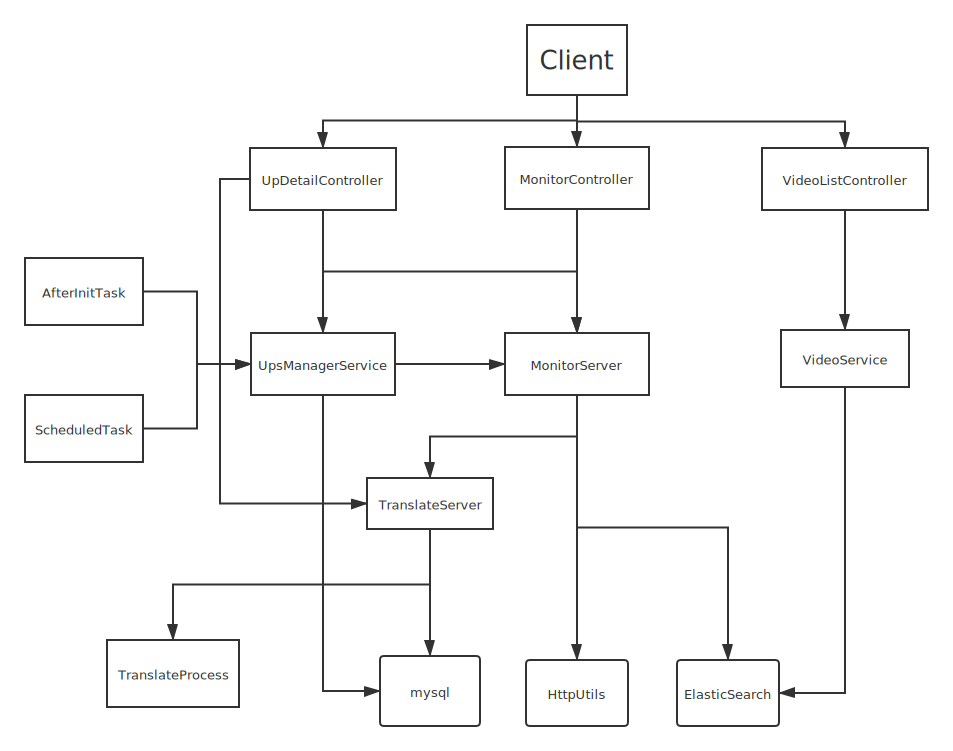

# B站账号监控软件

## 效果和布局

先登陆，默认账号： admin 密码： admin

--

这里显示所有已关注的账号

--

点击账户管理

--

可以通过"添加账户"按钮添加新的监控账号，只需要填入账号uid即可

--

点击账号下的查看详情

--

里面分为 "核心一览"、"作品列表" 和 "舆情分析"三大模块，核心一览可以查看账号的各项基本数据，但前提是至少每天启动一次服务器并收集足够的天数，若中途有一天少了可以自动线性补全

--

里面的可以查看指定的周期内UP的各项指标，以及指标下的增量数据和存量数据

--

更改周期为30天后坐标轴也会相应的改变

--

作品列表模块，是统计所有在 "给定周期内" 发布所有作品

--

还可以根据关键词搜索符合条件的视频，还有分页加载功能不方便演示

--

进入“分析视频”模块后，可以看到单个视频的基本信息

--

和该视频与Up的其他视频的平均水平相比较的数据差异

--

分析该视频的评论以及热词

--

分析该视频的所有弹幕及热词

--

舆情分析模块，可以统计该账号下的所有评论和弹幕中出现最多的关键词并显示出现的次数

--

按点赞数对评论进行排序并显示每个评论的视频来源和评论者的ID

## 如何安装？

### 环境搭建
需要预先安装ES 7.10.1 和 mysql,然后从项目的 resources/db 中拿到bilibili.sql文件并执行mysql脚本，ES索引会在每次项目启动时自动创建，故不需要自己手动创建
线程池大小需要在配置文件中根据自己监控Up的数量进行调配
### 拉取仓库:
直接克隆客户端Bilibili-monitoring-system-client和服务端Bilibili-monitoring-system-server到本地开发工具运行
### 注意事项
建议监控的Up流量不要太大，否则会被B站反爬虫屏蔽导致缺少弹幕或评论，线程池按需设置
## 项目架构

